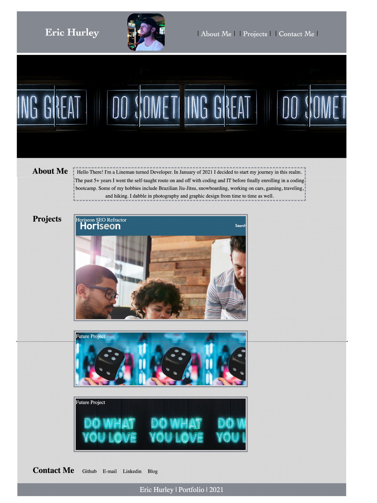

# Eric Hurley's Portfolio

My personal portfolio to give a brief introduction into myself and to showcase some of my projects along with how to get ahold of me at the provided links.

## Table of Contents
- Description of Portfolio Project
- Links to deployed portfolio and GitHub repo
- Screenshots
- Sources of Images

## Description of Portfolio Project
Starting with a blank text editor I built the HTML close to where I wanted it.  Next up was building the CSS and adjusting both as I went. The navigation links in the header will take you down below where the main body of my portfolio lies. A short intro to my self comes up first. Following that will be my projects section. Projects includes cards with a image, description, and links to repo and active site. Even further south on the page will bring you to a Contact Me section.  These are all links to profiles and my e-mail.

## Links to GitHub repo and deployed website
[Link to Repo](https://github.com/HurleySquared/hurley-portfolio)

[Link to Deployed Website](https://hurleysquared.github.io/hurley-portfolio/)

**Screenshots**

## Sources of Images
Three of the images used were taken from [Unsplash](https://unsplash.com/)
